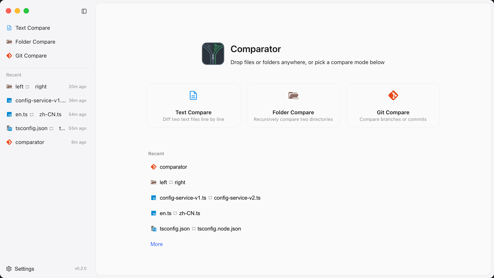
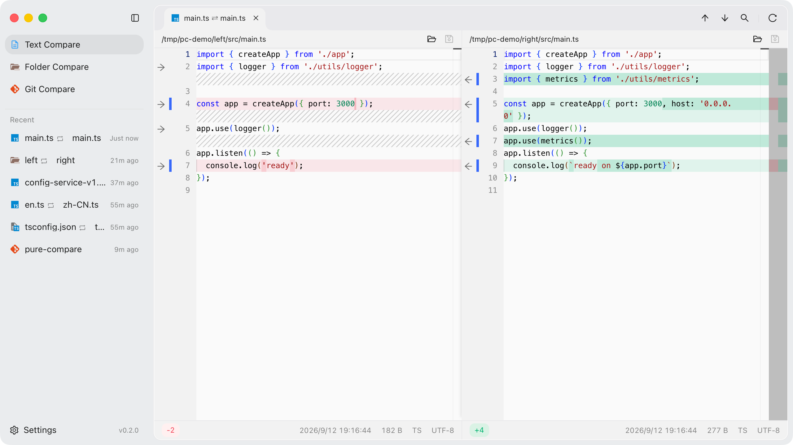
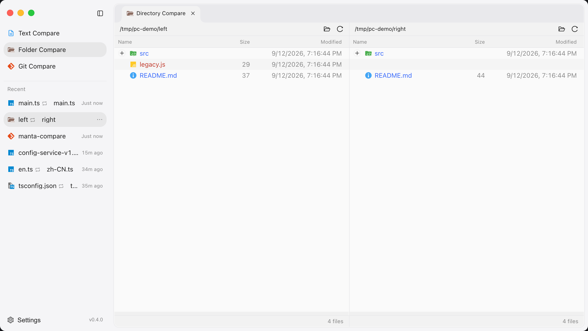
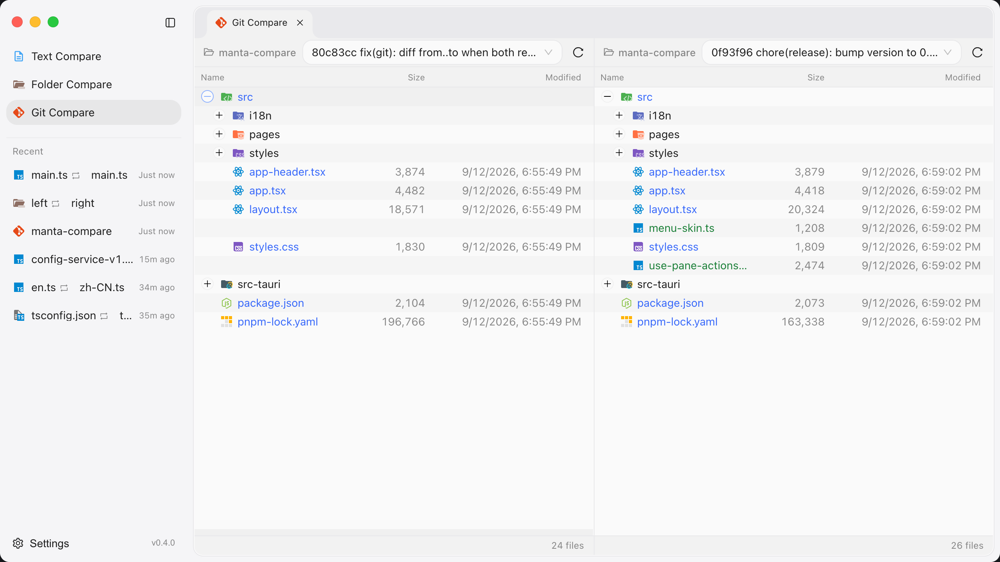

<div align="center">

# Comparator

**A fast, cross-platform diff tool for text, folders, and Git — powered by Tauri & Monaco.**

Compare files, folders, and Git revisions side by side with IDE-grade syntax highlighting.
A lightweight, native desktop alternative to Beyond Compare and Meld — free and open source.

**English** · [简体中文](./README.zh-CN.md)

🌐 **Website**: [https://marrviin.github.io/comparator/](https://marrviin.github.io/comparator/)

[](https://github.com/marrviin/comparator/actions/workflows/ci.yml)
[](https://github.com/marrviin/comparator/releases)
[](https://github.com/marrviin/comparator/releases)
[](LICENSE)


[**⬇️ Download**](https://github.com/marrviin/comparator/releases/latest) ·
[Features](#features) ·
[Screenshots](#screenshots) ·
[Build from source](#build-from-source)



</div>

## Why Comparator?

- ⚡ **Native & lightweight** — built on Tauri (Rust), not Electron. Small binary, low memory, instant startup.
- 🎨 **IDE-grade diff** — the Monaco editor (the engine behind VS Code) drives syntax highlighting and large-file handling.
- 🧭 **Three modes in one app** — text, folder, and Git comparison without switching tools.
- 🖥️ **Truly cross-platform** — one codebase, native installers for macOS, Windows, and Linux.
- 🆓 **Free & open source** — MIT licensed, no telemetry, no account.

## Features

- **Text compare** — drag in or pick two files and diff them line by line, with two-way editing and save.
- **Folder compare** — recursively compare two directories, listing added / modified / deleted entries; open any file to enter a line-by-line diff.
- **Git compare** — compare any two refs (including the working tree), browse the changed-file list (rename detection included) and per-file diff, and check out individual files.
- **Smart encoding** — automatic detection (UTF-8/16 BOM, GBK, etc.), binary detection, and a truncation guard for very large files.
- **Live & safe** — external file-change watching, unsaved-changes guard, ignore-rule settings, and colored file icons (Material Icon Theme).

## Screenshots

| Text compare | Folder compare |
| --- | --- |
|  |  |
| **Side-by-side file diff** | **Git compare** |
|  |  |

## Download

Grab the installer for your platform from the [**latest release**](https://github.com/marrviin/comparator/releases/latest):

| Platform | File |
| --- | --- |
| macOS (Apple Silicon + Intel) | `.dmg` |
| Windows | `.msi` / `.exe` |
| Linux | `.AppImage` / `.deb` |

> The app is not yet code-signed. On macOS, if you see “app is damaged”, run `xattr -cr /Applications/Pure\ Compare.app`. On Windows, click **More info → Run anyway** on the SmartScreen prompt.

## Tech Stack

- **Frontend**: React 19, React Router 7, Ant Design 6, Monaco Editor, Tailwind CSS 4, Vite.
- **Backend**: Tauri 2 (Rust) — file IO, encoding detection, and directory/Git diff all run on the Rust side.

## Build from source

Prerequisites: Node ≥ 20, pnpm, and the Rust toolchain (`cargo`).

```bash
pnpm install          # install dependencies (postinstall syncs icon assets)
pnpm tauri dev        # launch the desktop app (dev mode)
pnpm tauri build      # produce installers for each platform
```

### Quality checks

```bash
pnpm build            # tsc type-check + vite build
pnpm lint             # eslint + stylelint
pnpm format:check     # prettier check
cd src-tauri && cargo fmt --check && cargo clippy && cargo test
```

## Contributing

Issues and pull requests are welcome. Please run the quality checks above before opening a PR.

## Acknowledgements

File icons come from the VSCode extension [material-icon-theme](https://github.com/material-extensions/vscode-material-icon-theme) (MIT).
Assets are generated from the npm package by `scripts/sync-material-icons.mjs` during `predev` / `prebuild` / `postinstall`, and are not tracked in version control.

## License

[MIT](LICENSE) © Comparator contributors

---

<div align="center">

<sub>Keywords: diff tool · file compare · folder compare · directory compare · git diff viewer · code compare · merge tool · Tauri · Rust · React · Monaco · Beyond Compare alternative · Meld alternative · cross-platform (macOS / Windows / Linux)</sub>

<br/>

⭐ If Comparator is useful to you, consider starring the repo — it helps others find it.

</div>
