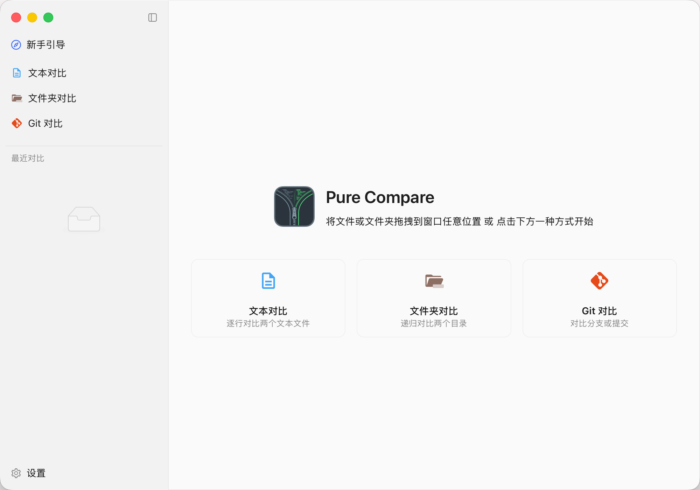

<div align="center">

# Pure Compare

**快速、跨平台的差异对比工具 —— 文本、文件夹、Git 三合一，基于 Tauri 与 Monaco。**

并排对比文件、文件夹与 Git 版本，带 IDE 级语言高亮。
Beyond Compare、Meld 的轻量原生替代品 —— 免费且开源。

[English](./README.md) · **简体中文**

[](https://github.com/marrviin/pure-compare/actions/workflows/ci.yml)
[](https://github.com/marrviin/pure-compare/releases)
[](https://github.com/marrviin/pure-compare/releases)
[](LICENSE)


[**⬇️ 下载**](https://github.com/marrviin/pure-compare/releases/latest) ·
[功能](#功能) ·
[截图](#截图) ·
[从源码构建](#从源码构建)



</div>

## 为什么选择 Pure Compare？

- ⚡ **原生轻量** —— 基于 Tauri（Rust）而非 Electron。体积小、占用低、秒开。
- 🎨 **IDE 级 diff** —— 由 Monaco 编辑器（VS Code 的内核）驱动语言高亮与大文件处理。
- 🧭 **一个应用三种模式** —— 文本、文件夹、Git 对比，无需切换工具。
- 🖥️ **真·跨平台** —— 一套代码，原生输出 macOS、Windows、Linux 安装包。
- 🆓 **免费开源** —— MIT 协议，无遥测、无需登录。

## 功能

- **文本对比** —— 拖入或选择左右两个文件逐行对比，支持双向编辑与保存。
- **文件夹对比** —— 递归比对两个目录，列出新增 / 修改 / 删除 / 重命名，点开任一文件进入逐行 diff。
- **Git 对比** —— 对比任意两个 ref（含工作区），查看变更文件列表与逐行 diff，可检出单文件。
- **智能编码** —— 自动探测（UTF-8/16 BOM、GBK 等）、二进制识别、超大文件截断保护。
- **实时且安全** —— 文件外部改动监听、未保存修改守卫、忽略规则设置、彩色文件图标（Material Icon Theme）。

## 截图

_即将上线 —— 更多截图与演示 GIF。_

## 下载

从 [**最新 Release**](https://github.com/marrviin/pure-compare/releases/latest) 获取对应平台的安装包：

| 平台 | 文件 |
| --- | --- |
| macOS（Apple Silicon + Intel 通用包） | `.dmg` |
| Windows | `.msi` / `.exe` |
| Linux | `.AppImage` / `.deb` |

> 应用尚未进行代码签名。macOS 若提示「已损坏，无法打开」，执行 `xattr -cr /Applications/Pure\ Compare.app`；Windows 遇到 SmartScreen 提示时点击 **更多信息 → 仍要运行**。

## 技术栈

- **前端**：React 19、React Router 7、Ant Design 6、Monaco Editor、Tailwind CSS 4、Vite。
- **后端**：Tauri 2（Rust），文件 IO / 编码探测 / 目录与 Git diff 均在 Rust 侧完成。

## 从源码构建

前置依赖：Node ≥ 20、pnpm、Rust 工具链（`cargo`）。

```bash
pnpm install          # 安装依赖（postinstall 会同步图标资源）
pnpm tauri dev        # 启动桌面应用（开发模式）
pnpm tauri build      # 产出各平台安装包
```

### 质量校验

```bash
pnpm build            # tsc 类型检查 + vite 构建
pnpm lint             # eslint + stylelint
pnpm format:check     # prettier 校验
cd src-tauri && cargo fmt --check && cargo clippy && cargo test
```

## 参与贡献

欢迎提交 Issue 与 Pull Request。提 PR 前请先跑通上面的质量校验。

## 致谢

文件图标来自 VSCode 扩展 [material-icon-theme](https://github.com/material-extensions/vscode-material-icon-theme)（MIT）。
资源由 `scripts/sync-material-icons.mjs` 在 `predev` / `prebuild` / `postinstall` 时从 npm 包生成，不纳入版本控制。

## 许可证

[MIT](LICENSE) © Pure Compare contributors

---

<div align="center">

<sub>关键词：差异对比 · 文件对比 · 文件夹对比 · 目录对比 · git diff · 代码对比 · 合并工具 · Tauri · Rust · React · Monaco · Beyond Compare 替代品 · Meld 替代品 · 跨平台（macOS / Windows / Linux）</sub>

<br/>

⭐ 如果 Pure Compare 对你有帮助，欢迎点个 Star —— 能帮到更多人发现它。

</div>
